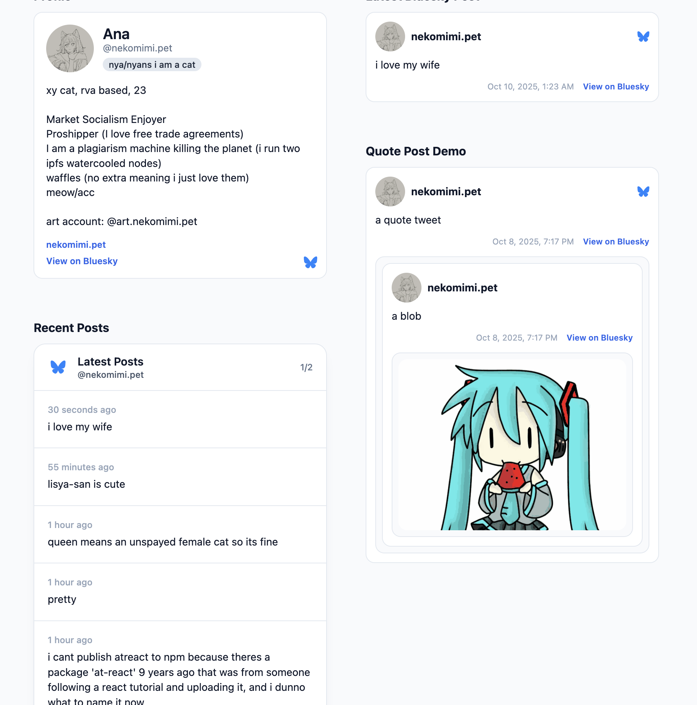

# atproto-ui

A React component library for rendering AT Protocol records (Bluesky, Leaflet, Tangled, and more). Handles DID resolution, PDS discovery, and record fetching automatically. [Live demo](https://atproto-ui.wisp.place).

## Screenshots




## Features

- **Drop-in components** for common record types (`BlueskyPost`, `BlueskyProfile`, `TangledString`, `LeafletDocument`)
- **Prefetch support** - Pass data directly to skip API calls (perfect for SSR/caching)
- **Customizable theming** - Override CSS variables to match your app's design
- **Composable hooks** - Build custom renderers with protocol primitives
- Built on lightweight [`@atcute/*`](https://tangled.org/@mary.my.id/atcute) clients

## Installation

```bash
npm install atproto-ui
```

## Quick Start

```tsx
import { AtProtoProvider, BlueskyPost, LeafletDocument } from "atproto-ui";
import "atproto-ui/styles.css";

export function App() {
	return (
		<AtProtoProvider>
			<BlueskyPost did="did:plc:example" rkey="3k2aexample" />
			{/* You can use handles too */}
			<LeafletDocument did="nekomimi.pet" rkey="3m2seagm2222c" />
		</AtProtoProvider>
	);
}
```

**Note:** The library automatically imports the CSS when you import any component. If you prefer to import it explicitly (e.g., for better IDE support or control over load order), you can use `import "atproto-ui/styles.css"`.

## Theming

Components use CSS variables for theming. By default, they respond to system dark mode preferences, or you can set a theme explicitly:

```tsx
// Set theme via data attribute on document element
document.documentElement.setAttribute("data-theme", "dark"); // or "light"

// For system preference (default)
document.documentElement.removeAttribute("data-theme");
```

### Available CSS Variables

```css
--atproto-color-bg
--atproto-color-bg-elevated
--atproto-color-text
--atproto-color-text-secondary
--atproto-color-border
--atproto-color-link
/* ...and more, check out lib/styles.css */
```

### Override Component Theme

Wrap any component in a div with custom CSS variables to override its appearance:

```tsx
import { AtProtoStyles } from "atproto-ui";

<div style={{
  '--atproto-color-bg': '#f0f0f0',
  '--atproto-color-text': '#000',
  '--atproto-color-link': '#0066cc',
} satisfies AtProtoStyles}>
  <BlueskyPost did="..." rkey="..." />
</div>
```

## Prefetched Data

All components accept a `record` prop. When provided, the component uses your data immediately without making network requests. Perfect for SSR, caching, or when you've already fetched data.

```tsx
import { BlueskyPost, useLatestRecord } from "atproto-ui";
import type { FeedPostRecord } from "atproto-ui";

const MyComponent: React.FC<{ did: string }> = ({ did }) => {
	// Fetch the latest post using the hook
	const { record, rkey, loading } = useLatestRecord<FeedPostRecord>(
		did,
		"app.bsky.feed.post"
	);

	if (loading) return <p>Loading…</p>;
	if (!record || !rkey) return <p>No posts found.</p>;

	// Pass the fetched record directly—BlueskyPost won't re-fetch it
	return <BlueskyPost did={did} rkey={rkey} record={record} />;
};
```

All components support prefetched data:

```tsx
<BlueskyProfile did={did} record={profileRecord} />
<TangledString did={did} rkey={rkey} record={stringRecord} />
<LeafletDocument did={did} rkey={rkey} record={documentRecord} />
```

### Using atcute Directly

Use atcute directly to construct records and pass them to components—fully compatible!

```tsx
import { Client, simpleFetchHandler, ok } from '@atcute/client';
import type { AppBskyFeedPost } from '@atcute/bluesky';
import { BlueskyPost } from 'atproto-ui';

// Create atcute client
const client = new Client({
    handler: simpleFetchHandler({ service: 'https://public.api.bsky.app' })
});

// Fetch a record
const data = await ok(
    client.get('com.atproto.repo.getRecord', {
        params: {
            repo: 'did:plc:ttdrpj45ibqunmfhdsb4zdwq',
            collection: 'app.bsky.feed.post',
            rkey: '3m45rq4sjes2h'
        }
    })
);

const record = data.value as AppBskyFeedPost.Main;

// Pass atcute record directly to component!
<BlueskyPost
    did="did:plc:ttdrpj45ibqunmfhdsb4zdwq"
    rkey="3m45rq4sjes2h"
    record={record}
/>
```

## API Reference

### Components

| Component | Description |
|-----------|-------------|
| `AtProtoProvider` | Context provider for sharing protocol clients. Optional `plcDirectory` prop. |
| `AtProtoRecord` | Core component for fetching/rendering any AT Protocol record. Accepts `record` prop. |
| `BlueskyProfile` | Profile card for a DID/handle. Accepts `record`, `fallback`, `loadingIndicator`, `renderer`. |
| `BlueskyPost` | Single Bluesky post. Accepts `record`, `iconPlacement`, custom renderers. |
| `BlueskyQuotePost` | Post with quoted post support. Accepts `record`. |
| `BlueskyPostList` | Paginated list of posts (default: 5 per page). |
| `TangledString` | Tangled string (code snippet) renderer. Accepts `record`. |
| `LeafletDocument` | Long-form document with blocks. Accepts `record`, `publicationRecord`. |

### Hooks

| Hook | Returns |
|------|---------|
| `useDidResolution(did)` | `{ did, handle, loading, error }` |
| `useLatestRecord(did, collection)` | `{ record, rkey, loading, error, empty }` |
| `usePaginatedRecords(options)` | `{ records, loading, hasNext, loadNext, ... }` |
| `useBlob(did, cid)` | `{ url, loading, error }` |
| `useAtProtoRecord(did, collection, rkey)` | `{ record, loading, error }` |

## Advanced Usage

### Using Hooks for Custom Logic

```tsx
import { useLatestRecord, BlueskyPost } from "atproto-ui";
import type { FeedPostRecord } from "atproto-ui";

const LatestBlueskyPost: React.FC<{ did: string }> = ({ did }) => {
	const { record, rkey, loading, error, empty } = useLatestRecord<FeedPostRecord>(
		did,
		"app.bsky.feed.post",
	);

	if (loading) return <p>Fetching latest post…</p>;
	if (error) return <p>Could not load: {error.message}</p>;
	if (empty || !record || !rkey) return <p>No posts yet.</p>;

	// Pass both record and rkey—no additional API call needed
	return <BlueskyPost did={did} rkey={rkey} record={record} colorScheme="system" />;
};
```

### Custom Renderer

Use `AtProtoRecord` with a custom renderer for full control:

```tsx
import { AtProtoRecord } from "atproto-ui";
import type { FeedPostRecord } from "atproto-ui";

<AtProtoRecord<FeedPostRecord>
	did={did}
	collection="app.bsky.feed.post"
	rkey={rkey}
	renderer={({ record, loading, error }) => (
		<article>
			<strong>{record?.text ?? "Empty post"}</strong>
		</article>
	)}
/>
```

## Demo

Check out the [live demo](https://atproto-ui.netlify.app/) to see all components in action.

### Running Locally

```bash
npm install
npm run dev
```

## Contributing

Contributions are welcome! Open an issue or PR for:
- New record type support (e.g., Grain.social photos)
- Improved documentation
- Bug fixes or feature requests

## License

MIT
